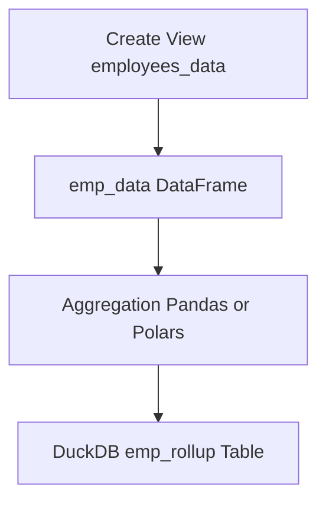

## Custom ETL

### 1 point
### Task description

Create custom ETL via Python. Load Data from MySQL to DuckDB.

Steps:
1. #### Use DB employees from 03Practice.
2. #### Create view employees_data that combines employee personal data, department assignment, and salary history by joining core HR tables.

##### Source Tables

 - employees
 - dept_emp
 - departments
 - salaries

##### Expected Output Columns

Return the following columns:

 - emp_no — Employee unique identifier
 - birth_date — Date of birth
 - first_name — Employee first name
 - last_name — Employee last name
 - gender — Employee gender
 - hire_date — Hiring date
 - dept_no — Department identifier
 - dept_name — Department name
 - salary — Salary amount
 - from_date — Salary validity start date
 - to_date — Salary validity end date

##### Result Characteristics

Produces historical salary records per employee.
 - May return multiple rows per employee due to:
   - Salary history
   - Department changes
 - No filtering applied (full historical dataset)

3. #### Aggregate in the same way but using Pandas or Polars. Below is a dataset in SQL, but you need to rewrite these transformations using Polars and Pandas:

~~~
-- CTE emp_data simulates feauture dataframe
WITH emp_data AS (
    SELECT
        emp_no,
        birth_date,
        first_name,
        last_name,
        gender,
        hire_date,
        dept_no,
        dept_name,
        salary,
        from_date,
        to_date
    FROM employees_data
),
     emp_rollup AS (
         SELECT
             emp_no,
             MIN(birth_date)  AS birth_date,
             MIN(first_name)  AS first_name,
             MIN(last_name)   AS last_name,
             MIN(gender)      AS gender,
             MIN(hire_date)   AS hire_date,

             COUNT(DISTINCT dept_no)  AS departments_worked,
             MIN(dept_no)             AS first_dept_no,      -- proxy if you don't have dept dates here
             MIN(dept_name)           AS first_dept_name,

             MIN(from_date) AS first_salary_from_date,
             MAX(to_date)   AS last_salary_to_date,
             COUNT(*)       AS salary_records,

             MIN(salary)    AS min_salary,
             MAX(salary)    AS max_salary,
             AVG(salary)    AS avg_salary,
             (MAX(salary) - MIN(salary)) AS salary_growth
         FROM emp_data
         GROUP BY emp_no
     )

select * from emp_rollup;
~~~

4. #### Load aggregated data into DuckDB table.

## Flow Chart

